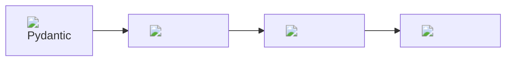

# Beanie Babies: API Edition

 Creating seamless and efficient APIs by

 Harnessing the Power of Beanie, Pydantic, FastAPI, and MongoDB


<br/>
<br/>


- Jim Vogel

---

# Obligatory Snake Reference


Yes there is a snake beanie baby

---

# Agenda
- Introduction
- Overview of Technologies
- Setting Up the Environment
- Modeling with Pydantic and Beanie
- Building the API with FastAPI
- Live Demo
- Conclusion
- Q&A

---

# Who Am I?

- Dev for 2 decades 
- Python, Vim, Process Improvement Enthusiast
- Experienced in data & math models, bringing them to life with Python
- Work at Gravitate, AI and math models in fuel supply chain
- From Flask to FastAPI, appreciating Python's expressiveness
- Automating repetitive workflows to improve efficiency
- Lifelong self-taught learner

<br/>
<br/>

### There are only two hard things in programming:
    - Naming things
    - Cache invalidation
    - And off-by-one errors

---

# Overview of Technologies
<br/>
<br/>

<div style="display: flex; justify-content: center;">
<div style="width: 60%;">

</div>
</div>
---

<div style="float: right; width: 30%;">
  
</div>

# Pydantic
## The Core of the Stack

<br/>

- Serialization library
- Super fast (built with Rust)
- Validation all in one
- Python type annotations driven

---

<div style="float: right; width: 30%;">
  
</div>

# MongoDB
## Flexible and Scalable Database

<br/>

- NoSQL database
- Stores JSON-like documents
- High performance and availability
- Easy scalability

---

<div style="float: right; width: 30%;">
  
</div>

# Beanie
## Seamless MongoDB Integration

<br/>

- Asynchronous ODM for MongoDB
- Built on Pydantic
- Easy and efficient interaction with MongoDB
- Supports data modeling and validation

---

<div style="float: right; width: 30%;">
  
</div>

# FastAPI
## High-Performance API Framework

<br/>

- Modern, fast web framework
- Built on standard Python type hints
- Automatic validation and serialization
- Interactive API documentation

---

# Setting Up the Environment
## Pre Reqs
- Docker (MongoDB)
- Recent python (3.12?)

## Installing Dependencies
- Command: `pip install fastapi beanie pydantic motor`

## Start a database
- Command: `docker run --rm -d -p 27017:27017 mongo`


---

# Modeling with Pydantic
## Explanation of Pydantic Models
Pydantic helps with data validation and settings management using Python type annotations.

## Example Code for Creating a Pydantic Model
```python
from pydantic import BaseModel

class Item(BaseModel):
    name: str
    description: str
    price: float
    tax: float
```

---

# Modeling with Pydantic
## Advanced Pydantic Features

- **Specific Types with Constraints**
  - Example: `name` with length constraints

- **Field-Level Validation**
  - Example: `price` greater than 0, `tax` greater than or equal to 0

- **Field Validator**
  - Ensuring `name` is alphanumeric

- **Model Validator**
  - Ensuring `tax` is not greater than `price`

--- 

## Example

```python
from typing import Annotated
from pydantic import BaseModel, Field, constr, validator, root_validator

class Item(BaseModel):
    name: Annotated[str, constr(min_length=3, max_length=50)]
    price: Annotated[float, Field(gt=0)]
    tax: Annotated[float, Field(ge=0)]

    @field_validator('name')
    def name_must_be_alphanumeric(cls, value):
        if not value.isalnum():
            raise ValueError('name must be alphanumeric')
        return value

    @model_validator
    def check_price_tax(cls, values):
        price = values.get('price')
        tax = values.get('tax')
        if price is not None and tax is not None and tax > price:
            raise ValueError('tax must not be greater than price')
        return values
```

---

# Live Demo
lets look at pycharm and see the code

---

# Conclusion

- Benefits of using Beanie, Pydantic, FastAPI, and MongoDB
- Same UI from database to client 
- Reusing existing knowledge

---

# Q&A
Open floor for questions from the audience.

---

# Thank You!
- Jim Vogel
